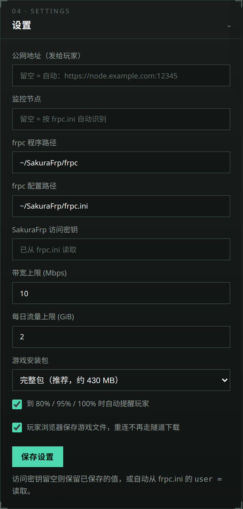

<div align="center">

# 安装指南<br><sub>Install and setup</sub>

macOS · Windows · Linux

[简体中文](#简体中文) · [English](#english) · [返回 README](README.md) · [下载 Download](https://github.com/whyhea1/stronghold-host-panel/releases/latest)

</div>

---

# 简体中文

本指南在一台新电脑上从零配置面板，直到得到可用的玩家链接。有两种方式：[自动安装](#自动安装)由脚本完成全部步骤；[手动安装](#手动安装)逐步说明，命令以 macOS 为准，Windows 或 Linux 有差异时在下方单独列出。整个流程只需做一次，之后开服只需运行启动文件并点击「开始联机」。

## 自动安装

安装脚本完成下方[手动安装](#手动安装)的第 1–8 步：

| 步骤 | 内容 |
|---|---|
| Node.js 22 | 系统中有 22 或更高版本时直接使用；否则从 nodejs.org 或 npmmirror 下载官方构建到面板文件夹的 `runtime/node`，校验 SHA-256。不需要管理员权限，不改动系统 |
| 面板 | 从 Releases 下载最新 ZIP；在面板文件夹中运行时跳过。已有的 `config.json`、`usage.json` 和 `runtime/` 保留 |
| `frpc` | 从 SakuraFrp API 获取当前系统和 CPU 的最新版本，校验 MD5，放到 `~/SakuraFrp/` |
| 隧道 | 用访问密钥列出本地端口为 `3000` 的 TCP 隧道供选择；没有时列出可用节点（国内节点在前）并新建一条。隧道未启用自动 HTTPS 或本地 IP 不是 `127.0.0.1` 时，脚本可以直接修改 |
| `frpc.ini` | 运行 `frpc -f <访问密钥>:<隧道 ID> -w` 写入 `~/SakuraFrp/frpc.ini`，旧文件备份为 `frpc.ini.bak` |
| 游戏 | 用面板的更新程序下载最新版本到 `~/StrongholdProtocol/current` |

运行前需要：SakuraFrp 账号并完成实名认证，以及访问密钥（[用户信息](https://www.natfrp.com/user/)）。见[第 4 步](#4-创建隧道)中的 SakuraFrp 文档链接。

下载 GitHub 文件时，脚本依次尝试本机代理端口、直连和下载镜像，规则与[第 5.2 步](#52-让面板访问-github)相同。访问 SakuraFrp 时始终直连。脚本可以重复运行，用于更新面板、修复配置；要换隧道，运行 `node lib/setup.mjs --tunnel`。

### 方法一：ZIP 中的安装脚本

从 [Releases](https://github.com/whyhea1/stronghold-host-panel/releases/latest) 下载对应系统的 ZIP 并解压，然后：

| 系统 | 操作 |
|---|---|
| macOS | 双击 `Install-Stronghold-Panel.command`。被 macOS 拦截时，右键文件并选择「打开」 |
| Windows | 双击 `Install-Stronghold-Panel.bat`。SmartScreen 拦截时，选择「更多信息 → 仍要运行」 |
| Linux | 在面板文件夹中，于终端运行 `./install.sh` |

### 方法二：一行命令

不需要先下载 ZIP。面板默认安装到 `~/Stronghold-Host-Panel`，运行时可以修改。

macOS / Linux（终端）：

```bash
curl -fsSL https://raw.githubusercontent.com/whyhea1/stronghold-host-panel/main/install.sh | bash
```

Windows（PowerShell）：

```powershell
irm https://raw.githubusercontent.com/whyhea1/stronghold-host-panel/main/install.ps1 | iex
```

无法访问 `raw.githubusercontent.com` 时，在地址前加镜像前缀：

```bash
curl -fsSL https://ghfast.top/https://raw.githubusercontent.com/whyhea1/stronghold-host-panel/main/install.sh | bash
```

```powershell
irm https://ghfast.top/https://raw.githubusercontent.com/whyhea1/stronghold-host-panel/main/install.ps1 | iex
```

### 参数

| macOS / Linux | Windows | 作用 |
|---|---|---|
| `--dir <文件夹>` | `$env:SH_DIR = "<文件夹>"` | 面板文件夹 |
| `--lang zh` / `--lang en` | `$env:SH_LANG = "zh"` | 界面语言，默认跟随系统 |
| `--update` | `$env:SH_UPDATE = 1` | 在面板文件夹中运行时也下载最新面板 |
| `--yes` | `$env:SH_YES = 1` | 所有问题使用默认答案 |

一行命令加参数：`curl -fsSL https://raw.githubusercontent.com/whyhea1/stronghold-host-panel/main/install.sh | bash -s -- --dir ~/Desktop/Stronghold-Host-Panel`。Windows 先设置环境变量，再运行 `irm … | iex`。

### 安装之后

1. 运行启动文件，见[第 6 步](#6-首次启动)。
2. 如果代理软件使用 TUN 或全局接管模式，按[第 5.1 步](#51-让-frpc-直连)添加 frpc 直连规则。脚本检测到本机代理端口时会提示。
3. 按[第 7 步](#7-检查玩家链接)和[第 9 步](#9-开服前测试)检查玩家链接。

## 手动安装

以下步骤与安装脚本的操作相同，也可用于排查脚本报告的问题。

### 准备

| 项目 | 获取方式 | 说明 |
|---|---|---|
| macOS、Windows 10/11 或 Linux | | Apple 芯片或 Intel，x64 或 ARM |
| Node.js 22 或更高 | Homebrew / winget / nvm | 游戏要求 Node 22 或更高 |
| SakuraFrp 账号 | [natfrp.com](https://www.natfrp.com/) | 免费套餐足够少量玩家使用 |
| SakuraFrp `frpc`（命令行） | `~/SakuraFrp/frpc`（Windows：`frpc.exe`） | 不需要 SakuraFrp 启动器 |
| 代理软件（可选） | | 仅在访问 GitHub 需要代理时使用，规则见第 5 步 |

### 1. 安装 Node.js 22

```bash
brew install node@22
echo 'export PATH="/opt/homebrew/opt/node@22/bin:$PATH"' >> ~/.zshrc
source ~/.zshrc
node -v
```

最后一条命令应输出 `v22.x` 或更高。Intel Mac 上 Homebrew 的路径是 `/usr/local/opt/node@22/bin`，启动文件两个路径都会查找。

- Windows（PowerShell）：`winget install OpenJS.NodeJS.LTS`，然后新开一个窗口运行 `node -v`。
- Linux：安装 [nvm](https://github.com/nvm-sh/nvm#installing-and-updating)，然后运行 `nvm install 22`。发行版自带的 Node 版本通常低于 22。另需安装 `curl` 和 `unzip`（Debian/Ubuntu：`sudo apt install curl unzip`）。

### 2. 获取面板

从 [Releases](https://github.com/whyhea1/stronghold-host-panel/releases/latest) 下载对应系统的 ZIP：`macos`、`windows` 或 `linux`，解压到任意位置（例如桌面）。文件夹中包含面板、文档、`config.example.json` 和对应系统的启动文件。不需要 Git。

如需改用 `git pull` 更新面板，见 [使用 Git 克隆（可选）](#使用-git-克隆可选)。

### 3. 安装 SakuraFrp 命令行客户端

1. 从 [SakuraFrp 下载页](https://www.natfrp.com/tunnel/download) 下载对应系统的 `frpc`：macOS 选 `darwin`，Windows 选 `windows`，Linux 选 `linux`。Apple 芯片和 ARM 选 `arm64`，Intel 和 AMD 选 `amd64`。原版 frp 无法连接 SakuraFrp。
2. 移动到固定位置，并去掉 macOS 的隔离标记：

   ```bash
   mkdir -p ~/SakuraFrp
   mv ~/Downloads/frpc_*_darwin_*/frpc ~/SakuraFrp/
   chmod +x ~/SakuraFrp/frpc
   xattr -d com.apple.quarantine ~/SakuraFrp/frpc 2>/dev/null
   ~/SakuraFrp/frpc -V
   ```

   - Linux：命令相同，去掉 `xattr` 那一行。
   - Windows：新建文件夹 `C:\Users\<用户名>\SakuraFrp`，把文件放进去并改名为 `frpc.exe`。然后在 PowerShell 中运行 `~\SakuraFrp\frpc.exe -V`。

3. 确认版本号中含有 `sakura`。请使用最新版；低于 `0.51.0-sakura-7` 的版本处理自动 HTTPS 有问题。

### 4. 创建隧道

> SakuraFrp 官方文档：[内网穿透基础知识](https://doc.natfrp.com/basics.html) · [实名认证](https://doc.natfrp.com/faq/realname.html) · [Web 应用穿透指南（选择节点、创建 TCP 隧道）](https://doc.natfrp.com/app/http.html) · [自动 HTTPS](https://doc.natfrp.com/frpc/auto-https.html) · [frpc 基本使用指南](https://doc.natfrp.com/frpc/usage.html)

在 SakuraFrp 网站上新建隧道，参数如下：

| 字段 | 值 |
|---|---|
| 隧道类型 | TCP |
| 本地 IP | `127.0.0.1` |
| 本地端口 | `3000`（即 `config.json` 中的 `port`） |
| 自动 HTTPS | 启用 |
| 访问密码 | 留空 |

国内节点会拦截经 TCP 隧道传输的明文 HTTP，玩家会看到 `501 Not Implemented`。启用自动 HTTPS 后，`frpc` 接收玩家的 HTTPS 请求，再以明文 HTTP 转发给面板。因此玩家链接必须以 `https://` 开头（[SakuraFrp 自动 HTTPS 文档](https://doc.natfrp.com/frpc/auto-https.html)）。

然后把隧道配置写入本地。在隧道列表中打开「操作 → 配置文件」，复制启动参数（`-f 访问密钥:隧道ID`）：

```bash
cd ~/SakuraFrp
./frpc -f 你的访问密钥:隧道ID -w
grep auto_https frpc.ini
```

Windows（PowerShell）：`cd ~\SakuraFrp`，然后 `.\frpc.exe -f 你的访问密钥:隧道ID -w`，再运行 `Select-String auto_https frpc.ini`。

`grep`（或 `Select-String`）必须输出一行 `auto_https`。如果没有输出，说明网站没有保存自动 HTTPS 设置：重新保存后，再运行一次 `-w` 命令。

以后每次在网站上修改隧道，都要重新运行 `-w` 命令，然后在面板中重启隧道。

### 5. 代理软件设置

如果开服时电脑上开着代理软件，请完成这一步。系统代理、TUN 模式、虚拟网卡类的软件都算。没有使用代理的，直接跳到第 6 步。

代理软件会在三个地方影响面板：

| 流量 | 应走 | 原因 |
|---|---|---|
| `frpc` 到 SakuraFrp 节点 | 直连 | 隧道经代理连国内节点会失败或延迟高 |
| 玩家到中转站（127.0.0.1、局域网） | 直连 | 本地流量，大多数代理软件默认已直连 |
| 面板到 GitHub | 走代理 | 游戏下载、游戏更新 |

#### 5.1 让 frpc 直连

TUN 模式、增强模式等接管全部流量的模式下必须设置。仅系统代理模式下 `frpc` 不走代理，但仍建议加上规则，避免以后切换模式时隧道断开。

把以下规则放在规则列表最上面（越靠上优先级越高）。Windows 上进程名是 `frpc.exe`，写成 `PROCESS-NAME,frpc.exe,DIRECT`（sing-box 写 `"frpc.exe"`）。

Clash 格式 YAML 规则（写在软件的覆写 / merge 功能中）：

```yaml
rules:
  - PROCESS-NAME,frpc,DIRECT
  - IP-CIDR,127.0.0.0/8,DIRECT,no-resolve
  - IP-CIDR,192.168.0.0/16,DIRECT,no-resolve
```

JavaScript 脚本覆写：

```js
function main(config) {
  config.rules = [
    "PROCESS-NAME,frpc,DIRECT",
    "IP-CIDR,127.0.0.0/8,DIRECT,no-resolve",
    "IP-CIDR,192.168.0.0/16,DIRECT,no-resolve",
    ...(config.rules || []),
  ];
  return config;
}
```

Surge 格式规则（`[Rule]` 段）：

```ini
PROCESS-NAME,frpc,DIRECT
IP-CIDR,127.0.0.0/8,DIRECT,no-resolve
IP-CIDR,192.168.0.0/16,DIRECT,no-resolve
```

sing-box JSON 配置（`route.rules`，放在其他规则之前）：

```json
{ "process_name": ["frpc"], "outbound": "direct" },
{ "ip_cidr": ["127.0.0.0/8", "192.168.0.0/16"], "outbound": "direct" }
```

sing-box 配置中，如果直连出站的 tag 不是 `direct`，请换成你自己的 tag。

如果软件不支持进程规则，就为隧道节点域名（`frpc.ini` 中的 `server_addr`）加一条直连规则，例如 `DOMAIN-SUFFIX,<server_addr>,DIRECT`；或者开服期间关闭 TUN，只用系统代理模式。

面板还会从 `frpc` 的环境中移除 `http_proxy`、`https_proxy`、`all_proxy`。frp 会读取这些变量，所以在 `~/.zshrc` 中导出的代理不会影响隧道。

验证方法：启动隧道，打开代理软件的连接列表，`frpc` 的连接应显示 DIRECT。

#### 5.2 让面板访问 GitHub

面板访问 GitHub 时（检查更新、下载游戏），先按以下顺序尝试本机代理端口，每个端口先试 HTTP 再试 SOCKS5：`7890`、`7897`、`10809`、`10808`、`6152`、`6153`、`1087`、`1080`。这些是常见代理软件的默认端口。没有可用端口时直连。你的端口可以在代理软件设置中找到，通常叫「混合端口」「HTTP 端口」或「SOCKS 端口」。

如果端口不在其中，在 `config.json` 中设置 `ghProxy`，然后重启面板：

```json
{ "ghProxy": "http://127.0.0.1:你的端口" }
```

只有 SOCKS 端口时，写 `socks5h://127.0.0.1:你的端口`。面板下载期间代理软件必须保持开启。代理和直连都失败时，面板尝试 `ghMirrors` 中的镜像。下载时，如果某条线路持续 20 秒低于 100 KB/s，面板换下一条；面板日志显示每次尝试的线路。GitHub API 每个 IP 每小时限 60 次请求，共享 IP（运营商 NAT、代理节点）容易用完；此时面板改从 Releases 页面读取版本。

### 6. 首次启动

1. 双击 `Start-Stronghold-Panel.command`。首次运行可能被 macOS 拦截，此时右键文件并选择「打开」。
2. 面板在 <http://localhost:3100> 打开。
3. 面板用默认值生成 `config.json`，见 [config.json 参数](#configjson-参数)。

- Windows：双击 `Start-Stronghold-Panel.bat`。SmartScreen 拦截时，选择「更多信息 → 仍要运行」。Windows 防火墙询问 Node.js 时，允许专用网络：局域网玩家需要，隧道玩家不需要。
- Linux：在面板文件夹中，于终端运行 `./Start-Stronghold-Panel.sh`。

开服期间请保持终端窗口打开；关闭窗口时，面板会同时停止游戏和隧道。


### 7. 检查玩家链接

面板从 `frpc.ini` 读取玩家链接：使用 `server_addr` 和 `remote_port`，启用 `auto_https` 时使用 `https://`。链接显示在「玩家入口」卡片中，请确认它以 `https://` 开头。


面板还会根据 `server_addr` 找到你的节点，并从 `user =` 一行读取 SakuraFrp 访问密钥。因此通常无需在「设置」中填写任何内容。

如需使用其他链接（例如自定义域名），填写「设置 → 公网地址」。如需显示其他节点的状态，填写「设置 → 监控节点」。字段留空即恢复为 `frpc.ini` 中的值。

<details>
<summary>「设置」卡片</summary>



</details>

### 8. 安装游戏

点击游戏卡片中的「检查更新」，面板会显示「游戏有新版本」，点击「下载并安装」。面板从 [sganggs/Stronghold-Protocol](https://github.com/sganggs/Stronghold-Protocol) 下载发布包，安装到 `~/StrongholdProtocol/current`。


### 9. 开服前测试

1. 点击「开始联机」，等待游戏显示「运行中」、隧道显示「已连接」。
2. 手机关闭 Wi-Fi，使用移动数据。
3. 打开玩家链接，应能加载「中转站」页面。
4. 点击「进入游戏」并创建房间。

首次访问可能出现证书警告。Chrome 中选择「高级 → 继续前往」；Safari 中选择「显示详细信息 → 访问此网站」。

## config.json 参数

面板只在启动时读取一次 `config.json`，编辑文件后需重启面板。标为「面板」的参数也在「设置」中，在那里修改无需重启。

`config.json` 可能包含访问密钥，请勿分享该文件。`config.example.json` 展示了格式。

| 参数 | 默认值 | 面板 | 含义 |
|---|---|---|---|
| `publicUrl` | 空 | 是 | 发给玩家的链接，用于复制按钮和二维码。留空表示由 `frpc.ini` 生成。 |
| `nodeName` | 空 | 是 | 要显示状态的 SakuraFrp 节点。留空表示按 `frpc.ini` 中的 `server_addr` 查找。 |
| `frpcBin` | `~/SakuraFrp/frpc`（Windows：`~/SakuraFrp/frpc.exe`） | 是 | `frpc` 程序路径 |
| `frpcConfig` | `~/SakuraFrp/frpc.ini` | 是 | 第 4 步生成的隧道配置路径 |
| `sakuraToken` | 空 | 是 | SakuraFrp 访问密钥。留空表示读取 `frpc.ini` 中的 `user =`。 |
| `speedLimitMbps` | `10` | 是 | 隧道限速，用于带宽仪表 |
| `dailyLimitGB` | `2` | 是 | 每日流量预算（GiB），以 UTC+8 零点为日界，仅提醒 |
| `dailyAutoBroadcast` | `true` | 是 | 在 80%、95%、100% 时向玩家显示「流量提醒」 |
| `port` | `3000` | 否 | 中转站对外端口，必须与隧道的本地端口一致 |
| `gameInternalPort` | `3001` | 否 | 游戏在 127.0.0.1 上的端口，位于中转站之后 |
| `panelPort` | `3100` | 否 | 主机面板在 127.0.0.1 上的端口 |
| `gameRoot` | `~/StrongholdProtocol` | 否 | 存放 `current/`、`previous/`、`updates/` 的目录 |
| `repo` | `sganggs/Stronghold-Protocol` | 否 | 游戏发布所在的 GitHub 仓库 |
| `ghProxy` | `auto` | 否 | `auto` 依次尝试 `proxyPorts` 中的端口，`none` 关闭代理。也可以直接填 URL，例如 `http://127.0.0.1:7890` 或 `socks5h://127.0.0.1:1080`。 |
| `proxyPorts` | `[7890, 7897, 10809, 10808, 6152, 6153, 1087, 1080]` | 否 | `auto` 模式尝试的本机代理端口（HTTP 和 SOCKS5），见第 5.2 步 |
| `ghMirrors` | `["https://ghfast.top/", "https://gh-proxy.com/"]` | 否 | GitHub 失败时使用的下载镜像 |

`config.json` 只需写与默认值不同的参数，标准安装下 `{}` 即可。在面板中保存设置时会补全其他参数。例如使用自定义域名：

```json
{
  "publicUrl": "https://play.example.com:12345"
}
```

## 面板生成的文件

Windows 上 `~` 指用户文件夹，例如 `C:\Users\<用户名>`。

| 路径 | 内容 |
|---|---|
| `config.json` | 你的设置 |
| `usage.json` | 今日流量计数，重启不会清零 |
| `~/StrongholdProtocol/current/` | 已安装的游戏 |
| `~/StrongholdProtocol/previous/` | 上次更新前的版本，用于回滚 |
| `~/StrongholdProtocol/updates/` | 下载中的文件 |

## 更新面板

1. 停止面板：关闭终端窗口或按 Ctrl+C。
2. 从 [Releases](https://github.com/whyhea1/stronghold-host-panel/releases/latest) 下载新 ZIP 并解压。
3. 把旧文件夹中的 `config.json` 和 `usage.json` 复制到新文件夹。
4. 从新文件夹启动面板。之后可以删除旧文件夹。

也可以运行[一行安装命令](#方法二一行命令)并选择同一文件夹：脚本覆盖面板文件，保留 `config.json`、`usage.json` 和 `runtime/`。

游戏安装在 `~/StrongholdProtocol`，不在面板文件夹内，更新面板不会影响游戏。使用 Git 克隆的，见 [用 Git 更新](#用-git-更新)。

## 故障排查

| 现象 | 处理 |
|---|---|
| 玩家看到 `501 Not Implemented` | 使用了 `http://`。发送 `https://` 链接；如果自动 HTTPS 未启用，重做第 4 步。 |
| `https://` 报 `ERR_SSL_PROTOCOL_ERROR` | 当前运行的 `frpc` 未使用自动 HTTPS。运行 `grep auto_https ~/SakuraFrp/frpc.ini`（Windows：`Select-String auto_https ~\SakuraFrp\frpc.ini`）。无输出时，重新运行第 4 步的 `-w` 命令，然后在面板中重启隧道。 |
| 开着代理软件时隧道失败或延迟高 | `frpc` 经过了代理。添加第 5.1 步的规则，并确认连接显示 DIRECT。 |
| 隧道显示「隧道已在线」 | 旧的 `frpc` 仍在连接。点击「断开」再点击「连接」；仍无效时关闭 SakuraFrp 启动器后再点击「连接」。 |
| 红色横幅：端口 3000 被占用 | 其他程序占用了端口 3000。点击「重启并接管」。 |
| 面板提示游戏未安装 | 完成第 8 步 |
| 检查 GitHub 失败 | 开启代理软件。端口不在 `proxyPorts` 中时设置 `ghProxy`，见第 5.2 步。 |
| macOS 拦截 `frpc` 或启动文件 | 运行 `xattr -d com.apple.quarantine <文件>`，或右键文件选择「打开」 |
| Windows 拦截 `frpc.exe` 或 `.bat` 文件 | SmartScreen：选择「更多信息 → 仍要运行」。杀毒软件删除 `frpc.exe` 时，把 `SakuraFrp` 文件夹加入排除项。 |
| Linux：「could not extract the ZIP」 | 安装 `unzip`（`sudo apt install unzip`），再点击一次「下载并安装」 |
| Linux：没有桌面通知 | 安装 `notify-send`（Debian/Ubuntu：`sudo apt install libnotify-bin`）。面板横幅不依赖它。 |
| 游戏无法启动 | 运行 `node -v`，应输出 `v22.x` 或更高；然后查看面板「日志」卡片中的「游戏」标签。 |

## 使用 Git 克隆（可选）

如果希望用 `git pull` 更新面板，可以用克隆代替发布 ZIP。克隆会拿到 `main` 上的每个提交，包括尚未发布的提交；也会包含文档截图。

### 安装 Git

- macOS：运行 `git --version`。提示安装命令行开发者工具时，选择安装，这一步会安装 Git。
- Windows（PowerShell）：`winget install Git.Git`，然后新开一个窗口。
- Linux：用包管理器安装 `git`（Debian/Ubuntu：`sudo apt install git`）。

### 克隆仓库

在 VS Code 中：

1. 按 Cmd+Shift+P（Windows 和 Linux：Ctrl+Shift+P），输入 `Git: Clone`，选择「Clone from GitHub」。
2. 选择 `whyhea1/stronghold-host-panel`。
3. 位置选桌面，然后打开该文件夹。

终端中的等效命令（PowerShell 中同样可用）：

```bash
cd ~/Desktop
git clone https://github.com/whyhea1/stronghold-host-panel.git
```

然后从第 3 步继续。Linux 上，克隆中的启动文件是 `Start-Stronghold-Panel.command`，用 `./Start-Stronghold-Panel.command` 运行。

### 用 Git 更新

1. 停止面板：关闭终端窗口或按 Ctrl+C。
2. VS Code 中点击状态栏的 Sync；终端中在面板文件夹运行 `git pull`。
3. 重新启动面板。

`config.json` 和 `usage.json` 都在 `.gitignore` 中，Git 更新不会改动它们。

### 让 git 和 VS Code 访问 GitHub

开着代理软件（第 5 步）时，`git` 和 VS Code 也需要访问 GitHub。TUN 模式下通常无需设置。如果无法连接，只让 GitHub 流量走代理端口：

```bash
git config --global http.https://github.com.proxy http://127.0.0.1:你的端口
```

VS Code：按 Cmd+Shift+P（Windows 和 Linux：Ctrl+Shift+P），选择「Preferences: Open User Settings (JSON)」，加入以下两行，然后重启 VS Code：

```json
"http.proxy": "http://127.0.0.1:你的端口",
"http.proxySupport": "override"
```

以后要撤销 git 设置，运行 `git config --global --unset http.https://github.com.proxy`。

---

# English

This guide sets up the panel on a new computer, from nothing to a working player link. There are two ways. With [Automatic install](#automatic-install), a script does all the steps. [Manual install](#manual-install) shows each step. Its commands are for macOS, and where Windows or Linux is different, a line below the command shows the difference. Do it once. After that, hosting is: double-click the start file, then click 开始联机.

## Automatic install

The installer does steps 1–8 of [Manual install](#manual-install):

| Step | What it does |
|---|---|
| Node.js 22 | Uses Node 22 or later if the system has it. Otherwise it downloads the official build from nodejs.org or npmmirror into `runtime/node` in the panel folder and checks the SHA-256. No admin rights, and the system stays unchanged |
| Panel | Downloads the newest ZIP from Releases. It skips this step when it runs from a panel folder. It keeps `config.json`, `usage.json`, and `runtime/` |
| `frpc` | Gets the newest build for your system and CPU from the SakuraFrp API, checks the MD5, and puts it in `~/SakuraFrp/` |
| Tunnel | Uses your access key to list the TCP tunnels to local port `3000`. If there is none, it lists the nodes you can use (mainland nodes first) and creates a tunnel. If the tunnel does not use 自动 HTTPS, or its local IP is not `127.0.0.1`, the installer can change it |
| `frpc.ini` | Runs `frpc -f <access key>:<tunnel ID> -w` to write `~/SakuraFrp/frpc.ini`, and keeps the old file as `frpc.ini.bak` |
| Game | Uses the panel updater to download the newest version into `~/StrongholdProtocol/current` |

Before you start, you need a SakuraFrp account with the real-name verification done, and your access key ([用户信息](https://www.natfrp.com/user/)). [Step 4](#4-create-the-tunnel) has the links to the SakuraFrp docs.

For GitHub files, the installer tries local proxy ports, then direct, then download mirrors, with the same rules as [step 5.2](#52-let-the-panel-reach-github). SakuraFrp is always direct. You can run the installer again to update the panel or repair the setup. To change the tunnel, run `node lib/setup.mjs --tunnel`.

### Option 1: the installer in the ZIP

Download the ZIP for your system from [Releases](https://github.com/whyhea1/stronghold-host-panel/releases/latest) and unzip it. Then:

| System | Do this |
|---|---|
| macOS | Double-click `Install-Stronghold-Panel.command`. If macOS blocks it, right-click the file and select Open |
| Windows | Double-click `Install-Stronghold-Panel.bat`. If SmartScreen blocks it, select More info → Run anyway |
| Linux | In the panel folder, run `./install.sh` in a terminal |

### Option 2: one command

You do not need the ZIP first. The default panel folder is `~/Stronghold-Host-Panel`, and the installer asks before it uses it.

macOS / Linux (terminal):

```bash
curl -fsSL https://raw.githubusercontent.com/whyhea1/stronghold-host-panel/main/install.sh | bash
```

Windows (PowerShell):

```powershell
irm https://raw.githubusercontent.com/whyhea1/stronghold-host-panel/main/install.ps1 | iex
```

If `raw.githubusercontent.com` is not reachable, put the mirror prefix in front of the address:

```bash
curl -fsSL https://ghfast.top/https://raw.githubusercontent.com/whyhea1/stronghold-host-panel/main/install.sh | bash
```

```powershell
irm https://ghfast.top/https://raw.githubusercontent.com/whyhea1/stronghold-host-panel/main/install.ps1 | iex
```

### Options

| macOS / Linux | Windows | Effect |
|---|---|---|
| `--dir <folder>` | `$env:SH_DIR = "<folder>"` | Panel folder |
| `--lang zh` / `--lang en` | `$env:SH_LANG = "en"` | Language. The default follows the system |
| `--update` | `$env:SH_UPDATE = 1` | Also download the newest panel when it runs from a panel folder |
| `--yes` | `$env:SH_YES = 1` | Use the default answer for every question |

With the one command: `curl -fsSL https://raw.githubusercontent.com/whyhea1/stronghold-host-panel/main/install.sh | bash -s -- --dir ~/Desktop/Stronghold-Host-Panel`. On Windows, set the variable first, then run `irm … | iex`.

### After the install

1. Run the start file. See [step 6](#6-first-start).
2. If your proxy app uses a TUN or capture-all mode, add the frpc direct rule from [step 5.1](#51-send-frpc-direct). The installer tells you when it finds a local proxy port.
3. Check the player link with [step 7](#7-check-the-player-link) and [step 9](#9-test-before-game-night).

## Manual install

These steps do the same as the installer. Use them also to find the cause when the installer reports a problem.

### What you need

| Item | Where it goes | Notes |
|---|---|---|
| macOS, Windows 10/11, or Linux | | Apple silicon or Intel, x64 or ARM |
| Node.js 22 or later | Homebrew / winget / nvm | The game needs Node 22 or later |
| SakuraFrp account | [natfrp.com](https://www.natfrp.com/) | The free plan is enough for a few players |
| SakuraFrp `frpc` (CLI) | `~/SakuraFrp/frpc` (Windows: `frpc.exe`) | You do not need the SakuraFrp launcher app |
| A proxy app (optional) | | Only if you need one to reach GitHub. Step 5 shows the rules. |

### 1. Install Node.js 22

```bash
brew install node@22
echo 'export PATH="/opt/homebrew/opt/node@22/bin:$PATH"' >> ~/.zshrc
source ~/.zshrc
node -v
```

The last command must print `v22.x` or later. On an Intel Mac, Homebrew uses `/usr/local/opt/node@22/bin`. The start file finds both paths.

- Windows (PowerShell): `winget install OpenJS.NodeJS.LTS`. Then open a new window and run `node -v`.
- Linux: install [nvm](https://github.com/nvm-sh/nvm#installing-and-updating), then run `nvm install 22`. Distro packages are often older than 22. Also install `curl` and `unzip` (Debian/Ubuntu: `sudo apt install curl unzip`).

### 2. Get the panel

Download the ZIP for your system from [Releases](https://github.com/whyhea1/stronghold-host-panel/releases/latest): `macos`, `windows`, or `linux`. Unzip it, for example to the Desktop. The folder contains the panel, the docs, `config.example.json`, and the start file for your system. You do not need Git.

To update the panel with `git pull` instead, see [Git clone (optional)](#git-clone-optional).

### 3. Install the SakuraFrp CLI

1. Download `frpc` for your system from the [SakuraFrp download page](https://www.natfrp.com/tunnel/download): `darwin` for macOS, `windows` for Windows, `linux` for Linux. Use `arm64` for Apple silicon and ARM, and `amd64` for Intel and AMD. Stock frp cannot connect to SakuraFrp.
2. Move it into place and remove the macOS quarantine flag:

   ```bash
   mkdir -p ~/SakuraFrp
   mv ~/Downloads/frpc_*_darwin_*/frpc ~/SakuraFrp/
   chmod +x ~/SakuraFrp/frpc
   xattr -d com.apple.quarantine ~/SakuraFrp/frpc 2>/dev/null
   ~/SakuraFrp/frpc -V
   ```

   - Linux: the same commands, without the `xattr` line.
   - Windows: make the folder `C:\Users\<you>\SakuraFrp`, put the file there, and rename it to `frpc.exe`. Then run `~\SakuraFrp\frpc.exe -V` in PowerShell.

3. Make sure that the version text contains `sakura`. Use the newest build. Versions older than `0.51.0-sakura-7` handle 自动 HTTPS incorrectly.

### 4. Create the tunnel

> SakuraFrp docs (Chinese): [basics](https://doc.natfrp.com/basics.html) · [real-name verification](https://doc.natfrp.com/faq/realname.html) · [web app guide: pick a node, create a TCP tunnel](https://doc.natfrp.com/app/http.html) · [auto HTTPS](https://doc.natfrp.com/frpc/auto-https.html) · [frpc usage](https://doc.natfrp.com/frpc/usage.html)

On the SakuraFrp website, create a tunnel with these values:

| Field | Value |
|---|---|
| Type | TCP |
| 本地 IP | `127.0.0.1` |
| 本地端口 | `3000` (the `port` key in `config.json`) |
| 自动 HTTPS | 启用 |
| 访问密码 | empty |

Domestic nodes block plain HTTP through a TCP tunnel. Players then get `501 Not Implemented`. With 自动 HTTPS on, `frpc` accepts HTTPS from players and sends plain HTTP to the panel. Thus the player link must start with `https://` ([SakuraFrp auto-HTTPS docs](https://doc.natfrp.com/frpc/auto-https.html)).

Then write the tunnel config to disk. On the tunnel list, open 操作 → 配置文件 and copy the launch argument (`-f 访问密钥:隧道ID`):

```bash
cd ~/SakuraFrp
./frpc -f 你的访问密钥:隧道ID -w
grep auto_https frpc.ini
```

Windows (PowerShell): `cd ~\SakuraFrp`, then `.\frpc.exe -f 你的访问密钥:隧道ID -w`, then `Select-String auto_https frpc.ini`.

The `grep` (or `Select-String`) command must print an `auto_https` line. If it prints nothing, the website did not save the 自动 HTTPS setting. Save it again, then run the `-w` command again.

Each time you change the tunnel on the website, run the `-w` command again. Then restart the tunnel in the panel.

### 5. If you use a proxy app

Do this step if a proxy app runs on the computer while you host. This includes any app with a system proxy, a TUN mode, or a virtual network adapter. If you do not use a proxy, go to step 6.

A proxy app touches the panel in three places:

| Traffic | Must go | Why |
|---|---|---|
| `frpc` to the SakuraFrp node | Direct | A proxied tunnel to a domestic node fails or lags |
| Players to the hub (127.0.0.1, LAN) | Direct | Local traffic. Most apps already send it direct. |
| The panel to GitHub | Through the proxy | Game downloads and game updates |

#### 5.1 Send frpc direct

This is necessary in TUN mode, 增强模式, or any mode that catches all traffic. In system-proxy mode only, `frpc` does not use the proxy. But add the rule anyway, so that a later mode change does not break the tunnel.

Put these rules at the top of your rule list. Rules higher in the list win. On Windows, the process name is `frpc.exe`. Write `PROCESS-NAME,frpc.exe,DIRECT` (sing-box: `"frpc.exe"`) instead of `frpc`.

Apps with Clash-style YAML rules (put them in the override / 覆写 / merge feature of your app):

```yaml
rules:
  - PROCESS-NAME,frpc,DIRECT
  - IP-CIDR,127.0.0.0/8,DIRECT,no-resolve
  - IP-CIDR,192.168.0.0/16,DIRECT,no-resolve
```

Apps with a JavaScript override script:

```js
function main(config) {
  config.rules = [
    "PROCESS-NAME,frpc,DIRECT",
    "IP-CIDR,127.0.0.0/8,DIRECT,no-resolve",
    "IP-CIDR,192.168.0.0/16,DIRECT,no-resolve",
    ...(config.rules || []),
  ];
  return config;
}
```

Apps with Surge-style rules (`[Rule]` section):

```ini
PROCESS-NAME,frpc,DIRECT
IP-CIDR,127.0.0.0/8,DIRECT,no-resolve
IP-CIDR,192.168.0.0/16,DIRECT,no-resolve
```

Apps with a sing-box JSON config (`route.rules`, before other rules):

```json
{ "process_name": ["frpc"], "outbound": "direct" },
{ "ip_cidr": ["127.0.0.0/8", "192.168.0.0/16"], "outbound": "direct" }
```

In a sing-box config, use the tag of your own direct outbound if it is not `direct`.

If your app has no process rules, add a direct rule for the node domain of your tunnel (the `server_addr` value in `frpc.ini`, for example `DOMAIN-SUFFIX,<server_addr>,DIRECT`). Or turn off TUN and use system-proxy mode while you host.

The panel also removes `http_proxy`, `https_proxy`, and `all_proxy` from the environment of `frpc`. frp reads these variables, so a proxy that you export in `~/.zshrc` cannot catch the tunnel.

To make sure that the rule works, start the tunnel. Then open the connection list of your proxy app. The `frpc` connection must show DIRECT.

#### 5.2 Let the panel reach GitHub

For GitHub (update checks and game downloads), the panel first tries these local proxy ports in this order, as HTTP and then as SOCKS5: `7890`, `7897`, `10809`, `10808`, `6152`, `6153`, `1087`, `1080`. These are the default ports of common proxy apps. If no port works, it goes direct. The port of your app is in its settings, usually as "mixed port", "HTTP port", or "SOCKS port".

If your app uses a different port, set `ghProxy` in `config.json`, then restart the panel:

```json
{ "ghProxy": "http://127.0.0.1:你的端口" }
```

For a SOCKS-only port, use `socks5h://127.0.0.1:你的端口`. The proxy app must be on while the panel downloads. If the proxies and the direct route fail, the panel tries the mirrors in `ghMirrors`. If a download route stays under 100 KB/s for 20 s, the panel moves to the next route. The panel log shows each route it tries. The GitHub API allows 60 requests per hour per IP, and shared IPs (carrier NAT, proxy nodes) often use them up. Then the panel reads the version from the release page.

### 6. First start

1. Double-click `Start-Stronghold-Panel.command`. The first time, macOS can block it. Then right-click the file and select Open.
2. The panel opens at <http://localhost:3100>.
3. The panel creates `config.json` with the default values. See [config.json](#configjson).

- Windows: double-click `Start-Stronghold-Panel.bat`. If SmartScreen blocks it, select More info, then Run anyway. If Windows Firewall asks about Node.js, allow private networks. LAN players need this. Tunnel players do not.
- Linux: run `./Start-Stronghold-Panel.sh` in a terminal, in the panel folder.

Keep the terminal window open while you host. If you close it, the panel stops the game and the tunnel.


### 7. Check the player link

The panel reads the player link from `frpc.ini`. It uses `server_addr` and `remote_port`, and `https://` when `auto_https` is on. The link shows in the 玩家入口 card. Make sure that it starts with `https://`.


The panel also finds your node by `server_addr`, and reads the SakuraFrp 访问密钥 from the `user =` line. Thus you usually do not have to enter anything in 设置.

To use a different link, for example a custom domain, enter it in 设置 → 公网地址. To show the status of a different node, enter its name in 设置 → 监控节点. Leave a field empty to go back to the value from `frpc.ini`.

<details>
<summary>The 设置 card</summary>


</details>

### 8. Install the game

Click 检查更新 in the game card. The panel shows 游戏有新版本. Click 下载并安装. The panel downloads the release ZIP from [sganggs/Stronghold-Protocol](https://github.com/sganggs/Stronghold-Protocol) and installs it to `~/StrongholdProtocol/current`.


### 9. Test before game night

1. Click 开始联机. Wait until the game shows 运行中 and the tunnel shows 已连接.
2. On your phone, turn off Wi-Fi so that the phone uses mobile data.
3. Open the player link. The 中转站 page must load.
4. Click 进入游戏 and create a room.

The first visit can show a certificate warning. In Chrome, select Advanced, then proceed. In Safari, select Show Details, then visit the website.

## config.json

The panel reads `config.json` one time, when it starts. If you edit the file, restart the panel. The keys marked "Panel" are also in 设置. Changes there do not need a restart.

`config.json` can contain your 访问密钥, so do not share the file. `config.example.json` shows the format.

| Key | Default | Panel | Meaning |
|---|---|---|---|
| `publicUrl` | empty | yes | The link that players get, on the copy button and the QR code. Empty means "build it from `frpc.ini`". |
| `nodeName` | empty | yes | SakuraFrp node to show status for. Empty means "find it by `server_addr` in `frpc.ini`". |
| `frpcBin` | `~/SakuraFrp/frpc` (Windows: `~/SakuraFrp/frpc.exe`) | yes | Path to the `frpc` program |
| `frpcConfig` | `~/SakuraFrp/frpc.ini` | yes | Path to the tunnel config from step 4 |
| `sakuraToken` | empty | yes | SakuraFrp 访问密钥. Empty means "read `user =` from `frpc.ini`". |
| `speedLimitMbps` | `10` | yes | Tunnel speed limit, for the bandwidth gauge |
| `dailyLimitGB` | `2` | yes | Daily data budget in GiB. Days start at 00:00 UTC+8. Warning only. |
| `dailyAutoBroadcast` | `true` | yes | Show players a 流量提醒 bar at 80%, 95%, and 100% |
| `port` | `3000` | no | Public port of the hub. Must be the same as 本地端口 of the tunnel. |
| `gameInternalPort` | `3001` | no | Port of the game on 127.0.0.1, behind the hub |
| `panelPort` | `3100` | no | Port of the host panel on 127.0.0.1 |
| `gameRoot` | `~/StrongholdProtocol` | no | Folder for `current/`, `previous/`, and `updates/` |
| `repo` | `sganggs/Stronghold-Protocol` | no | GitHub repo for game releases |
| `ghProxy` | `auto` | no | `auto` tries the ports in `proxyPorts`. `none` turns proxies off. You can also give a URL, for example `http://127.0.0.1:7890` or `socks5h://127.0.0.1:1080`. |
| `proxyPorts` | `[7890, 7897, 10809, 10808, 6152, 6153, 1087, 1080]` | no | Local proxy ports that `auto` tries, as HTTP and SOCKS5. See step 5.2. |
| `ghMirrors` | `["https://ghfast.top/", "https://gh-proxy.com/"]` | no | Download mirrors, used if GitHub fails |

A `config.json` only needs the keys that are different from the defaults. With a standard setup, `{}` is enough. The panel adds the other keys when you save the settings. For example, to use a custom domain:

```json
{
  "publicUrl": "https://play.example.com:12345"
}
```

## Files the panel makes

On Windows, `~` is your user folder, for example `C:\Users\<you>`.

| Path | Content |
|---|---|
| `config.json` | Your settings |
| `usage.json` | Today's data count, so a restart does not reset it |
| `~/StrongholdProtocol/current/` | The installed game |
| `~/StrongholdProtocol/previous/` | The version before the last update, for rollback |
| `~/StrongholdProtocol/updates/` | Downloads in progress |

## Update the panel

1. Stop the panel. Close the terminal window or push Ctrl+C.
2. Download the new ZIP from [Releases](https://github.com/whyhea1/stronghold-host-panel/releases/latest) and unzip it.
3. Copy `config.json` and `usage.json` from the old folder into the new folder.
4. Start the panel from the new folder. Then you can delete the old folder.

You can also run the [one command](#option-2-one-command) and select the same folder. The installer writes the new panel files over the old ones and keeps `config.json`, `usage.json`, and `runtime/`.

The game is in `~/StrongholdProtocol`, outside the panel folder. A panel update does not touch it. With a Git clone, see [Update with Git](#update-with-git).

## Troubleshooting

| Problem | Fix |
|---|---|
| Players get `501 Not Implemented` | They used `http://`. Send the `https://` link. If 自动 HTTPS is off, do step 4 again. |
| `https://` gives `ERR_SSL_PROTOCOL_ERROR` | The running `frpc` does not use 自动 HTTPS. Run `grep auto_https ~/SakuraFrp/frpc.ini` (Windows: `Select-String auto_https ~\SakuraFrp\frpc.ini`). If it prints nothing, run the `-w` command from step 4 again. Then restart the tunnel in the panel. |
| The tunnel fails or lags, and a proxy app is on | `frpc` goes through the proxy. Add the rules from step 5.1, then make sure that the connection shows DIRECT. |
| Tunnel shows 隧道已在线 | An old `frpc` is still connected. Click 断开, then 连接. If that does not help, close the SakuraFrp launcher app and click 连接 again. |
| Red banner: port 3000 in use | Another program holds port 3000. Click 重启并接管. |
| The panel says the game is not installed | Do step 8 |
| GitHub check fails | Turn your proxy app on. If its port is not in `proxyPorts`, set `ghProxy`. See step 5.2. |
| macOS blocks `frpc` or the start file | Run `xattr -d com.apple.quarantine <file>`, or right-click the file and select Open |
| Windows blocks `frpc.exe` or the `.bat` file | SmartScreen: select More info, then Run anyway. If antivirus removes `frpc.exe`, add an exclusion for the `SakuraFrp` folder. |
| Linux: "could not extract the ZIP" | Install `unzip` (`sudo apt install unzip`), then click 下载并安装 again |
| Linux: no desktop notifications | Install `notify-send` (Debian/Ubuntu: `sudo apt install libnotify-bin`). The panel banner works without it. |
| The game does not start | Run `node -v`. It must print `v22.x` or later. Then read the Game logs tab in the panel. |

## Git clone (optional)

Use a clone instead of the release ZIP if you want to update the panel with `git pull`. A clone gets every commit on `main`, also before a release. It also contains the screenshots of the docs.

### Install Git

- macOS: run `git --version`. If macOS asks to install the command line developer tools, accept. This installs Git.
- Windows (PowerShell): `winget install Git.Git`, then open a new window.
- Linux: install `git` with your package manager (Debian/Ubuntu: `sudo apt install git`).

### Clone the repo

In VS Code:

1. Push Cmd+Shift+P (Windows and Linux: Ctrl+Shift+P), type `Git: Clone`, then select "Clone from GitHub".
2. Select `whyhea1/stronghold-host-panel`.
3. Select the Desktop as the location, then open the folder.

In a terminal (the same commands work in PowerShell):

```bash
cd ~/Desktop
git clone https://github.com/whyhea1/stronghold-host-panel.git
```

Then continue with step 3. On Linux, the start file in a clone is `Start-Stronghold-Panel.command`. Run it with `./Start-Stronghold-Panel.command`.

### Update with Git

1. Stop the panel. Close the terminal window or push Ctrl+C.
2. In VS Code, click Sync in the status bar. In a terminal, run `git pull` in the panel folder.
3. Start the panel again.

Git does not touch `config.json` or `usage.json`, because both are in `.gitignore`.

### Let git and VS Code reach GitHub

If you use a proxy app (step 5), `git` and VS Code also need GitHub. In TUN mode, they usually work without changes. If they cannot connect, send only GitHub traffic through your proxy port:

```bash
git config --global http.https://github.com.proxy http://127.0.0.1:你的端口
```

For VS Code, push Cmd+Shift+P (Windows and Linux: Ctrl+Shift+P) and select "Preferences: Open User Settings (JSON)". Add these lines, then restart VS Code:

```json
"http.proxy": "http://127.0.0.1:你的端口",
"http.proxySupport": "override"
```

To remove the git setting later, run `git config --global --unset http.https://github.com.proxy`.
