<div align="center">

<picture>
  <source media="(prefers-color-scheme: dark)" srcset="docs/images/hero-dark.png">
  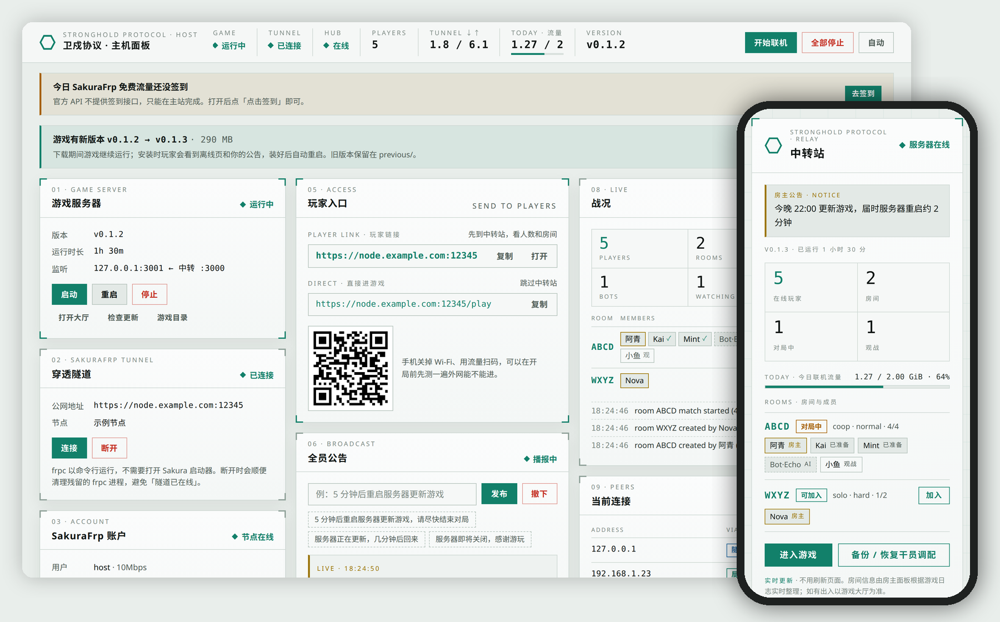
</picture>

# 卫戍协议 · 主机面板<br><sub>Stronghold Host Panel</sub>

在本机托管 [卫戍协议 Stronghold Protocol](https://github.com/sganggs/Stronghold-Protocol)，通过 SakuraFrp 隧道供外网玩家访问。全部操作在一个本地网页中完成。<br>
Host Stronghold Protocol for remote players through a SakuraFrp tunnel, from one local web page.

[](https://github.com/whyhea1/stronghold-host-panel/releases/latest)
[](#快速开始)
[](https://nodejs.org/)
[](#english)

**[下载 Download](https://github.com/whyhea1/stronghold-host-panel/releases/latest)** · **[安装指南 Install guide](INSTALL.md)** · [简体中文](#简体中文) · [English](#english)

</div>

---

# 简体中文

本项目是一个本地 Web 面板，用于在 macOS、Windows 或 Linux 上托管 [卫戍协议 Stronghold Protocol](https://github.com/sganggs/Stronghold-Protocol)，并通过 SakuraFrp 隧道供外网玩家访问。面板替代终端操作：负责启动游戏和 `frpc` 命令行客户端、显示日志，并在游戏前加一层玩家中转站。

无 npm 依赖，无需 `npm install`。需要 Node.js 22 或更高版本（游戏要求 22，面板本身 18 以上即可运行）。

## 快速开始

1. 从 **[Releases](https://github.com/whyhea1/stronghold-host-panel/releases/latest)** 下载对应系统的 ZIP 并解压。
2. 首次安装：运行文件夹中的安装脚本。脚本安装 Node.js 22 和 SakuraFrp `frpc`，用访问密钥选择或新建一条启用「自动 HTTPS」的 TCP 隧道，写入 `frpc.ini`，并下载游戏。只需运行一次。需要提前注册 SakuraFrp 并完成实名认证，见 **[安装指南](INSTALL.md#自动安装)**。
3. 之后每次开服：运行启动文件，点击「开始联机」，将 `https://` 玩家链接或二维码发给玩家。

| 系统 | 安装脚本（首次） | 启动文件（每次开服） |
|---|---|---|
| macOS | 双击 `Install-Stronghold-Panel.command` | 双击 `Start-Stronghold-Panel.command` |
| Windows | 双击 `Install-Stronghold-Panel.bat` | 双击 `Start-Stronghold-Panel.bat` |
| Linux | 终端运行 `./install.sh` | 终端运行 `./Start-Stronghold-Panel.sh`（Git 克隆中为 `.command`） |

不下载 ZIP 也可以，在终端运行一行命令（Windows 命令和镜像地址见[安装指南](INSTALL.md#方法二一行命令)）：

```bash
curl -fsSL https://raw.githubusercontent.com/whyhea1/stronghold-host-panel/main/install.sh | bash
```

需要逐步操作或排查问题时，见[手动安装](INSTALL.md#手动安装)。

面板地址为 <http://localhost:3100>。开服期间请保持终端窗口打开；关闭窗口时，面板会同时停止游戏和隧道。

## 工作原理

```
玩家浏览器
   │  https://<节点域名>:<远程端口>     SakuraFrp 自动 HTTPS
   ▼
SakuraFrp 节点  ◄── frpc（命令行子进程，强制直连）
                       │
                       ▼
               中转站 :3000（监听所有网卡，局域网玩家也从这里进入）
                 ├─ /              中转站页面
                 ├─ /play          反向代理 ──► 游戏 :3001（仅 127.0.0.1）
                 ├─ /backup        干员调配备份
                 └─ /status.json   状态数据

本机浏览器 ──► 主机面板 :3100（仅 127.0.0.1，其他设备无法访问）
```

| 端口 | 监听地址 | 用途 |
|---|---|---|
| 3000 | 所有网卡 | 中转站。`frpc` 和局域网玩家连接此端口，**隧道的本地端口必须填 3000** |
| 3001 | 127.0.0.1 | 游戏本体，仅中转站可访问 |
| 3100 | 127.0.0.1 | 主机面板，仅本机可访问 |

## 功能

<table>
<tr>
<td width="50%" valign="top">

**开服与停服**

「开始联机」同时启动游戏和 `frpc`，「全部停止」关闭全部进程。顶栏实时显示游戏、隧道、中转站状态，以及在线人数、隧道上下行速率（Mbps）、CPU 和内存占用、今日流量和游戏版本。

</td>
<td width="50%" valign="top">

**游戏更新**

从 GitHub Releases 检查 `sganggs/Stronghold-Protocol` 的新版本，一键下载安装，完成后自动重启游戏。安装卡片按步骤显示进度：下载（MB、速度、剩余时间、线路）、解压（文件数）、替换文件、下载素材、启动。上一版本保留在 `previous/`，可回滚。访问 GitHub 先走本机代理端口，再直连，最后用下载镜像；某条线路持续 20 秒低于 100 KB/s 时换下一条。

游戏从 v0.2.0 起分两种安装包，在「设置 → 游戏安装包」中选择：

- **完整包**（默认，推荐，约 430 MB）：带全部美术和音频，还有 3D 棋盘、召唤物模型等只在本机客户端使用的素材。
- **精简包**（约 22 MB）：装好后面板运行游戏自带的 `tools/setup.mjs`，从游戏素材源下载美术和音频（约 460 MB，可续传，不走 GitHub）。

素材缺失或不完整时，面板显示横幅，可以「下载素材」或「换成完整包」。

</td>
</tr>
<tr>
<td colspan="2">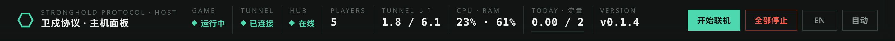<br>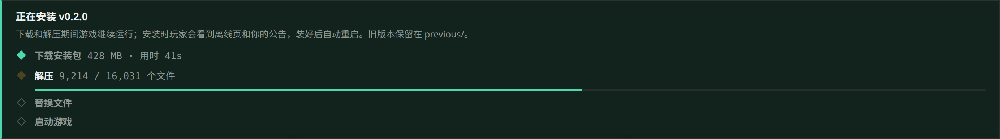</td>
</tr>
<tr>
<td valign="top">

**玩家入口**

玩家链接由 `frpc.ini` 中的 `server_addr` 和 `remote_port` 生成；启用 `auto_https` 时使用 `https://`。无需手动填写。提供复制按钮和二维码；`/play` 直链可跳过中转站。

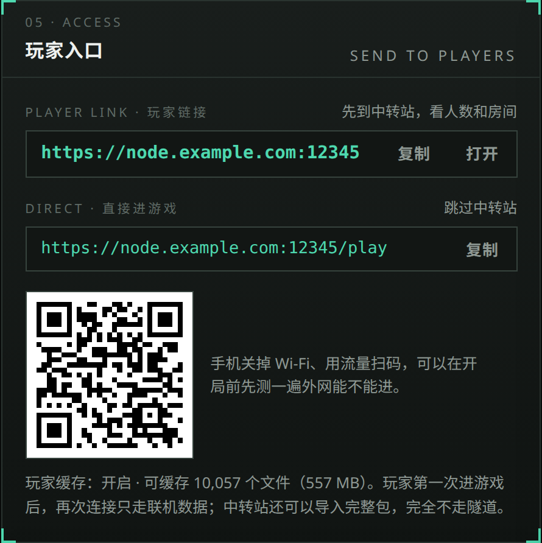

</td>
<td valign="top">

**战况**

显示在线人数、房间、房间成员、房主、准备状态、观战者和 AI。每个房间有「加入」「观战」按钮，在本机打开游戏并直接进入；「复制邀请」「复制观战链接」复制发给玩家的链接。数据来自中转站对游戏 WebSocket 中 `room.state` 帧的被动读取：不修改游戏文件。

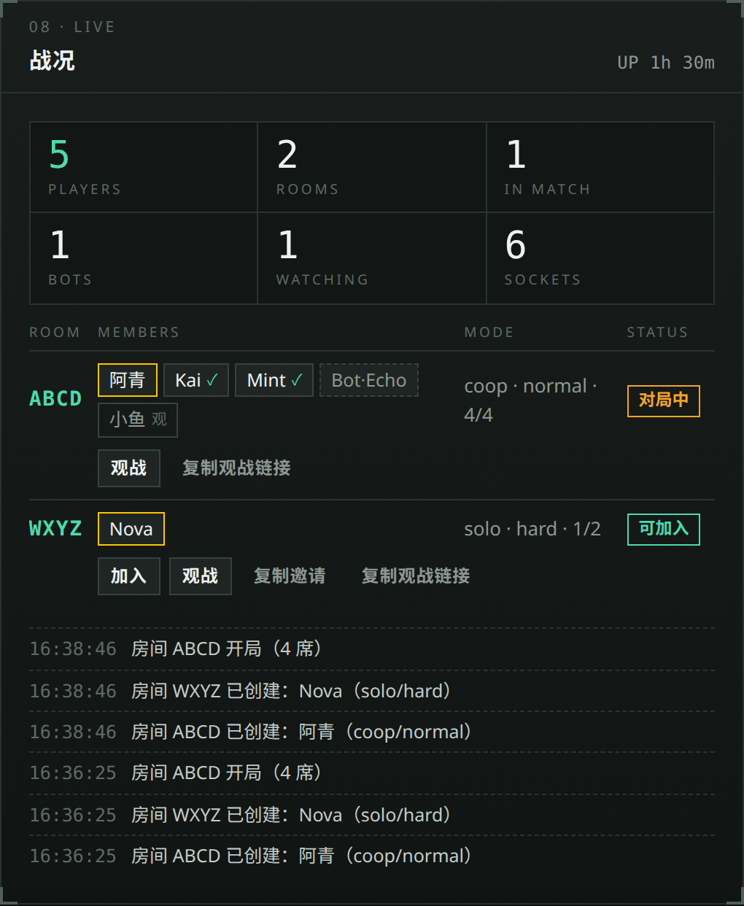

</td>
</tr>
<tr>
<td valign="top">

**全员公告**

发布的公告在 5 秒内显示在所有玩家页面顶部，包括对局页、中转站和离线页。内置常用预设文案。

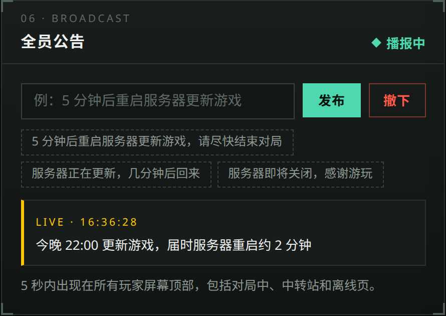

</td>
<td valign="top">

**每日流量**

默认上限 2 GiB/天，以 UTC+8 零点为日界，计数保存在 `usage.json`，重启不清零。达到 80%、95%、100% 时发送桌面通知并显示面板横幅，可选向玩家显示「流量提醒」。**仅提醒，不会停止游戏。**

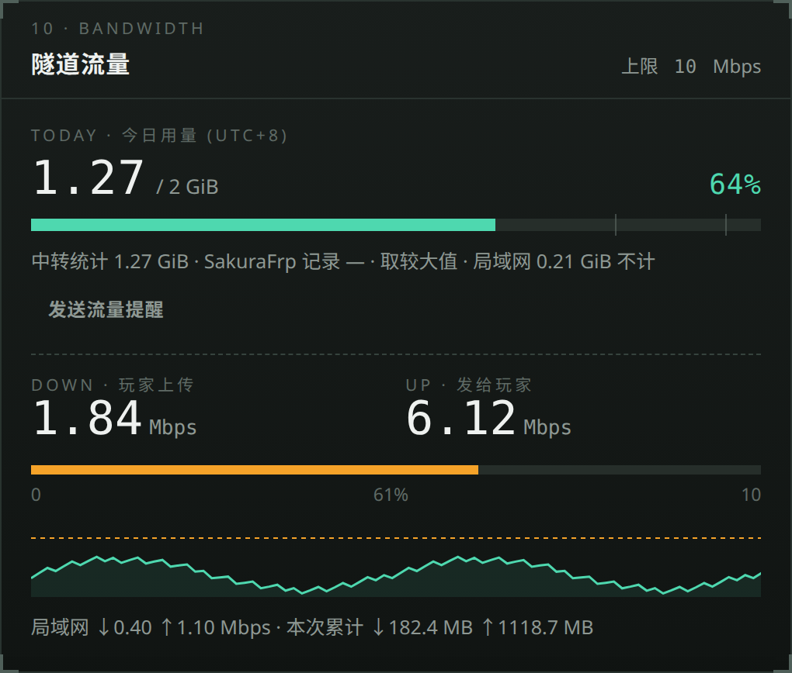

</td>
</tr>
<tr>
<td valign="top">

**SakuraFrp 账户**

通过 SakuraFrp API v4 显示剩余流量、流量包、节点状态与负载，并提醒每日签到（官方 API 不提供签到接口，需要在官网完成）。访问密钥默认读取 `frpc.ini` 中的 `user =`。

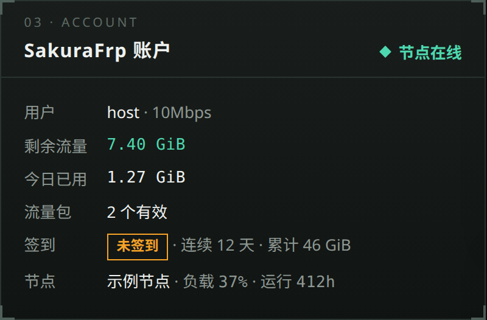

</td>
<td valign="top">

**隧道**

`frpc` 以命令行子进程运行，无需 Sakura 启动器，并会清理残留的 `frpc` 进程。启动时从 `frpc` 的环境中移除 `http_proxy`、`https_proxy`、`all_proxy`，因此 shell 中导出的代理变量不会影响隧道。

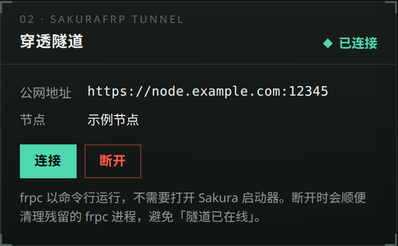

</td>
</tr>
<tr>
<td valign="top">

**主机负载**

整台电脑的 CPU 和内存占用（最近 3 分钟曲线），以及游戏服务器、`frpc`、面板各自的 CPU 和常驻内存，还有磁盘剩余空间和负载均值。只在面板页面打开时采样，每 2 秒一次。

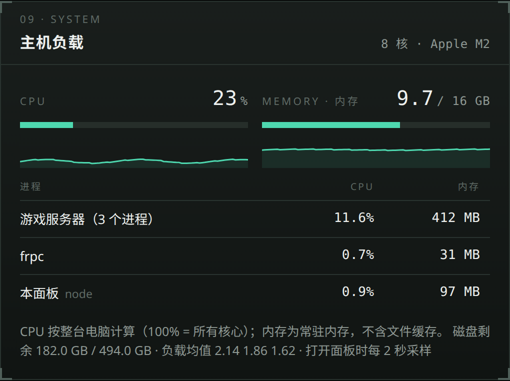

</td>
<td valign="top">

**省流量：玩家缓存**

SakuraFrp 自动 HTTPS 使用自签名证书，浏览器在这种页面上不保存 HTTP 缓存，所以以前玩家每次重连都会通过隧道重新下载约 500 MB 美术和音频。现在中转站把游戏文件存进玩家浏览器（IndexedDB），按文件 CRC32 和大小校验，游戏更新后只重新下载改过的文件。

玩家还可以在中转站「省流量」卡片中导入官方完整包 ZIP（从 GitHub 或国内镜像下载，不经过房主隧道），第一次进入也几乎不占隧道流量。房主可在「设置」中关闭此功能。

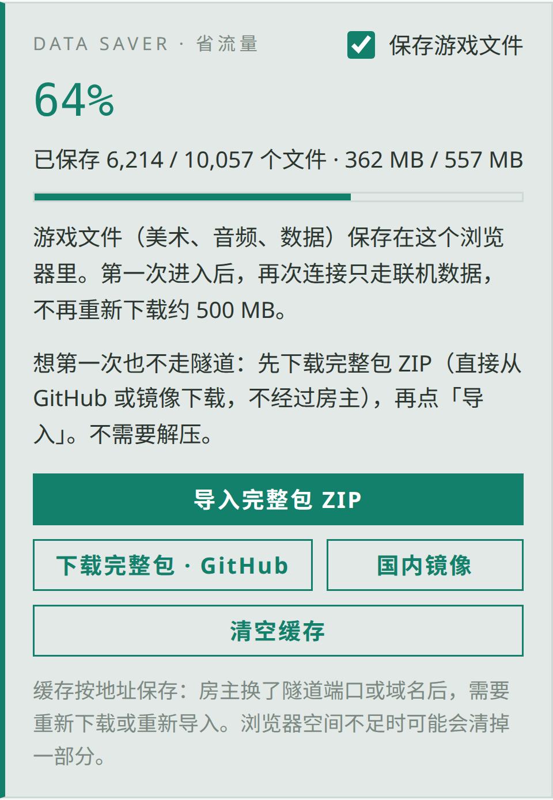

</td>
</tr>
</table>

界面默认简体中文，右上角可切换 English。中转站、离线页和备份页同样支持两种语言，并默认跟随玩家在游戏内选择的语言。界面支持亮色、暗色和跟随系统三种主题，并按窗口宽度在 3 栏、2 栏、1 栏之间切换。游戏已安装时，面板直接使用游戏自带的字体。

## 玩家端页面

<picture>
  <source media="(prefers-color-scheme: dark)" srcset="docs/images/phones-dark.png">
  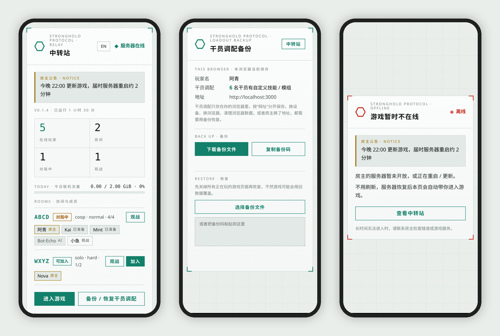
</picture>

| 路径（端口 3000） | 内容 |
|---|---|
| `/` | **中转站**：服务器状态、房间与成员（每个房间有「加入」「观战」按钮）、今日流量、省流量缓存。实时推送，无需刷新。 |
| `/play` | 游戏本体。`/play?room=CODE` 进入后直接加入房间，`/play?watch=CODE` 直接观战（对局中也可以）。 |
| `/backup` | **干员调配备份**：游戏将干员配置保存在浏览器存储中，并按网址区分。更换设备、浏览器或房主地址前，应先导出备份文件或备份码。 |
| `/status.json` | 中转站数据（JSON）。`/__panel/events` 以实时流提供同样的数据。 |

游戏未运行时，`/play` 显示**离线页**（含房主公告），游戏恢复后自动跳转回游戏。玩家端无需安装任何软件。

## 配置

首次启动时，面板根据 `lib/core.mjs` 中的默认值生成 `config.json`。标准安装无需修改。以下参数可在面板「设置」中修改，保存后立即生效：`publicUrl`、`frpcBin`、`frpcConfig`、`sakuraToken`、`nodeName`、`speedLimitMbps`、`dailyLimitGB`、`dailyAutoBroadcast`、`gamePackage`、`playerCache`。`lang` 由右上角的语言按钮设置。其他参数（端口、游戏目录、代理等）需编辑文件后重启面板。

完整参数表见 [安装指南：config.json 参数](INSTALL.md#configjson-参数)。

## 安全

- 面板只监听 `127.0.0.1:3100`，且只接受 `Host` 为 `localhost:3100` 或 `127.0.0.1:3100` 的请求。
- 所有操作请求都必须带 `X-Stronghold-Panel: 1` 请求头。其他网站无法发送该请求头，因此无法控制面板。
- 页面不显示访问密钥，API 只返回是否已设置。

## 常见问题

| 现象 | 原因与处理 |
|---|---|
| 玩家打开链接显示 `501` | 使用了 `http://`。自动 HTTPS 隧道只接受 `https://`。 |
| `https://` 报 `ERR_SSL_PROTOCOL_ERROR` | 当前运行的 `frpc` 未启用自动 HTTPS（`frpc.ini` 中没有 `auto_https`）。见 [第 4 步](INSTALL.md#4-创建隧道)。 |
| 开着代理软件（TUN / 全局接管模式）时隧道断开或延迟高 | `frpc` 流量进了代理。为 `frpc` 进程添加直连规则，见 [第 5 步](INSTALL.md#5-代理软件设置)。 |
| 检查更新失败 | 代理软件未开启，或其端口不在 `proxyPorts` 中。设置 `ghProxy`。 |
| 提示「隧道已在线」 | 已有旧的 `frpc` 连接同一条隧道。先断开再连接；仍无效时关闭 Sakura 启动器。 |
| 游戏画面是占位图 | 装的是精简包，素材还没下载。点横幅上的「下载素材」，或「换成完整包」。 |
| 玩家每次进游戏都很慢、很费流量 | 确认「设置」中玩家缓存已开启。玩家换了浏览器、用无痕模式，或你换了隧道地址时，缓存需要重新建立。 |

更多问题见 [安装指南：故障排查](INSTALL.md#故障排查)。

## 发布版本

在 GitHub 上用新标签（例如 `v1.1.0`）创建并发布 Release 后，`.github/workflows/release.yml` 会为 macOS、Windows、Linux 各构建一个 ZIP 并上传到该 Release。每个 ZIP 只包含面板、文档、示例配置和对应系统的启动文件。

## 目录结构

```
server.mjs            入口
install.sh            安装脚本（macOS / Linux；macOS ZIP 中为 Install-Stronghold-Panel.command）
install.ps1           安装脚本（Windows，由 Install-Stronghold-Panel.bat 启动）
lib/setup.mjs         安装脚本的共用部分：frpc、访问密钥、隧道、frpc.ini、游戏
lib/core.mjs          配置、共享状态、日志总线
lib/util.mjs          进程与网络工具函数
lib/platform.mjs      macOS / Windows / Linux 差异（打开、通知、防休眠、结束进程、解压）
lib/hub.mjs           端口 3000：中转站页面、游戏反向代理、流量统计
lib/roomwatch.mjs     从游戏流量中读取房间成员
lib/usage.mjs         每日流量预算
lib/game.mjs          游戏进程、健康检查、大厅日志解析
lib/tunnel.mjs        frpc 进程
lib/updater.mjs       从 GitHub 更新游戏
lib/sakura.mjs        SakuraFrp API
lib/sysstats.mjs      主机负载：CPU、内存、磁盘、进程
lib/assetcache.mjs    玩家缓存的文件清单（CRC32 + 大小）
lib/api.mjs           主机面板（127.0.0.1:3100）
web/                  面板界面（web/i18n.js 为中英文切换）
web/hub/              中转站页面、游戏内横幅脚本、玩家缓存（cache.js）
```

<details>
<summary><b>完整面板截图</b></summary>

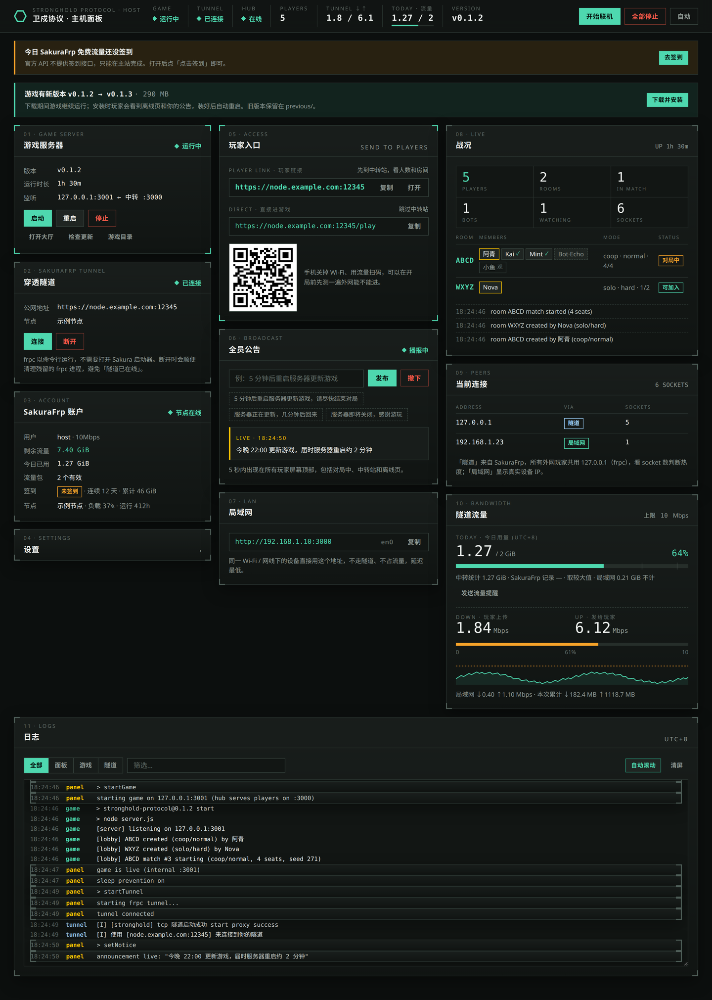

</details>

---

# English

A local web panel to host [Stronghold Protocol](https://github.com/sganggs/Stronghold-Protocol) on macOS, Windows, or Linux for remote players through a SakuraFrp tunnel. The panel replaces the terminal workflow. It starts the game and the `frpc` CLI, shows their logs, and puts a player hub in front of the game.

No npm dependencies and no `npm install`. Needs Node.js 22 or later (the game needs 22, the panel alone runs on 18 or later).

## Quick start

1. Download the ZIP for your system from **[Releases](https://github.com/whyhea1/stronghold-host-panel/releases/latest)** and unzip it.
2. On a new computer: run the installer in the folder. It installs Node.js 22 and the SakuraFrp `frpc`, uses your access key to select or create a TCP tunnel with 自动 HTTPS on, writes `frpc.ini`, and downloads the game. You do this one time. First, register at SakuraFrp and do the real-name verification. See the **[install guide](INSTALL.md#automatic-install)**.
3. To host: run the start file, click 开始联机, then send the `https://` player link or the QR code to your players.

| System | Installer (first time) | Start file (each time you host) |
|---|---|---|
| macOS | Double-click `Install-Stronghold-Panel.command` | Double-click `Start-Stronghold-Panel.command` |
| Windows | Double-click `Install-Stronghold-Panel.bat` | Double-click `Start-Stronghold-Panel.bat` |
| Linux | Run `./install.sh` in a terminal | Run `./Start-Stronghold-Panel.sh` in a terminal (`.command` in a Git clone) |

You can also skip the ZIP and run one command in a terminal (the Windows command and the mirror address are in the [install guide](INSTALL.md#option-2-one-command)):

```bash
curl -fsSL https://raw.githubusercontent.com/whyhea1/stronghold-host-panel/main/install.sh | bash
```

For each step by hand, or to find the cause of a problem, see [Manual install](INSTALL.md#manual-install).

The panel opens at <http://localhost:3100>. Keep the terminal window open while you host. If you close it, the panel stops the game and the tunnel.

## How it works

```
Player browser
   │  https://<node domain>:<remote port>   SakuraFrp auto HTTPS
   ▼
SakuraFrp node  ◄── frpc (CLI child process, always direct)
                       │
                       ▼
               Hub :3000 (all interfaces, LAN players also connect here)
                 ├─ /              中转站 page
                 ├─ /play          reverse proxy ──► game :3001 (127.0.0.1 only)
                 ├─ /backup        干员调配 backup
                 └─ /status.json   status data

Your browser ──► host panel :3100 (127.0.0.1 only, other devices cannot connect)
```

| Port | Bind | Purpose |
|---|---|---|
| 3000 | all interfaces | Hub. `frpc` and LAN players connect here. **The 本地端口 of the tunnel must be 3000.** |
| 3001 | 127.0.0.1 | The game. Only the hub talks to it. |
| 3100 | 127.0.0.1 | The host panel. Not reachable from other devices. |

## Features

<table>
<tr>
<td width="50%" valign="top">

**Start and stop**

开始联机 starts the game and `frpc` together. 全部停止 stops everything. The top bar shows the game, tunnel, and hub status, the players online, the tunnel speed (Mbps), the CPU and memory use, today's data use, and the game version.

</td>
<td width="50%" valign="top">

**Game updates**

The panel checks GitHub releases of `sganggs/Stronghold-Protocol`, installs a new version with one click, then restarts the game. The install card shows each step: download (MB, speed, time left, route), extract (file count), install files, download art, and start. It keeps the old version in `previous/` for rollback. For GitHub, the panel tries local proxy ports first, then direct, then download mirrors. A route that stays under 100 KB/s for 20 s is dropped for the next one.

From v0.2.0, the game has two packages. Select one in Settings → 游戏安装包:

- **Full** (default, recommended, about 430 MB): all art and audio, also client-only art such as the 3D board and the summon models.
- **Lite** (about 22 MB): after the install, the panel runs the game's own `tools/setup.mjs`, which downloads the art and audio from the game's asset sources (about 460 MB, resumable, not from GitHub).

When art is missing or incomplete, a banner offers 下载素材 (download art) or 换成完整包 (switch to the full package).

</td>
</tr>
<tr>
<td colspan="2"><br></td>
</tr>
<tr>
<td valign="top">

**Player link**

The panel builds the player link from `server_addr` and `remote_port` in `frpc.ini`, with `https://` when `auto_https` is on. You do not enter it. The card has a copy button and a QR code. The `/play` link skips the hub.


</td>
<td valign="top">

**Live rooms**

Players online, rooms, room members, the room host, ready state, spectators, and bots. Each room has 加入 (join) and 观战 (watch) buttons that open the game on this computer and enter the room. 复制邀请 and 复制观战链接 copy the links for players. The hub reads `room.state` frames from the game's WebSocket traffic and changes no game files.


</td>
</tr>
<tr>
<td valign="top">

**Announcements**

An announcement shows at the top of every player page within 5 seconds: in a match, on the hub, and on the offline page. The card has preset messages.


</td>
<td valign="top">

**Daily data budget**

2 GiB per day by default, with days that start at 00:00 UTC+8. The count is in `usage.json`, so a restart does not reset it. At 80%, 95%, and 100% the panel shows a desktop notification and a panel banner. It can also show players a 流量提醒 bar. **The panel never stops the game because of the budget.**


</td>
</tr>
<tr>
<td valign="top">

**SakuraFrp account**

Traffic, data plans, node status, and node load through SakuraFrp API v4, and a daily 签到 reminder. The API has no check-in call, so you check in on the website. The panel reads the 访问密钥 from the `user =` line in `frpc.ini`.


</td>
<td valign="top">

**Tunnel**

`frpc` runs as a CLI child process, without the SakuraFrp launcher app. The panel cleans up leftover `frpc` processes. It removes `http_proxy`, `https_proxy`, and `all_proxy` from the environment of `frpc`, so a proxy that you export in your shell cannot catch the tunnel.


</td>
</tr>
<tr>
<td valign="top">

**Host load**

The card shows the CPU and memory use of the whole computer, with a 3-minute graph. It also shows the CPU and resident memory of the game server, `frpc`, and the panel, the free disk space, and the load average. The panel samples every 2 seconds, only while the panel page is open.


</td>
<td valign="top">

**Data saver: player cache**

SakuraFrp 自动 HTTPS uses a self-signed certificate, and browsers keep no HTTP cache on such pages. Before, each reconnect downloaded about 500 MB of art and audio through the tunnel again. Now the hub keeps the game files in the player's browser (IndexedDB) and checks each file by CRC32 and size. After a game update, players download only the changed files.

On the hub's 省流量 card, players can also import the official full package ZIP. They download it from GitHub or a mirror in China, not through the host's tunnel, so even the first visit uses almost no tunnel data. The host can turn this off in Settings.


</td>
</tr>
</table>

The UI is in Simplified Chinese by default. The button at the top right changes it to English. The hub, the offline page, and the backup page also have both languages, and they follow the language that the player selected in the game. The UI has light, dark, and auto themes. The layout changes from 3 columns to 2 to 1 for the window width. The panel loads the game's fonts from the game install when they are available.

## Player pages

<picture>
  <source media="(prefers-color-scheme: dark)" srcset="docs/images/phones-dark.png">
  
</picture>

| Path (port 3000) | Page |
|---|---|
| `/` | **中转站**: players online, rooms and members (each room has join and watch buttons), daily data use, the data saver cache. Live updates, no refresh. |
| `/play` | The game. `/play?room=CODE` joins a room after the player enters. `/play?watch=CODE` watches a room, also during a match. |
| `/backup` | **干员调配 backup**: the game keeps loadouts in browser storage, per address. Players export a backup file or code before they change device, browser, or host address. |
| `/status.json` | 中转站 data as JSON. `/__panel/events` sends the same data as a live stream. |

When the game is down, `/play` shows an offline page with the host announcement. The page returns players to the game when it comes back. Players install nothing.

## Configuration

The panel creates `config.json` on first start with the defaults from `lib/core.mjs`. A standard setup needs no changes. You can change these keys in the panel settings, and they apply at once: `publicUrl`, `frpcBin`, `frpcConfig`, `sakuraToken`, `nodeName`, `speedLimitMbps`, `dailyLimitGB`, `dailyAutoBroadcast`, `gamePackage`, `playerCache`. The language button at the top right sets `lang`. Change the other keys (ports, game folder, proxy) in the file, then restart the panel.

[INSTALL.md](INSTALL.md#configjson) explains each key. 

## Security

- The panel listens on 127.0.0.1 only. It accepts only the `Host` values `localhost:3100` and `127.0.0.1:3100`.
- Every action needs the header `X-Stronghold-Panel: 1`. Other websites cannot send this header, so they cannot control the panel.
- The panel never shows the access key. The API only reports whether a key exists.

## Common problems

| Problem | Cause and fix |
|---|---|
| Players get `501` | They used `http://`. An auto-HTTPS tunnel accepts only `https://`. |
| `https://` gives `ERR_SSL_PROTOCOL_ERROR` | The running `frpc` does not use 自动 HTTPS (no `auto_https` in `frpc.ini`). See [step 4](INSTALL.md#4-create-the-tunnel). |
| The tunnel fails or lags while a proxy app is on (TUN or capture-all mode) | `frpc` goes through the proxy. Add a direct rule for the `frpc` process. See [step 5](INSTALL.md#5-if-you-use-a-proxy-app). |
| GitHub check fails | The proxy app is off, or its port is not in `proxyPorts`. Set `ghProxy`. |
| Tunnel shows 隧道已在线 | An old `frpc` is still connected to the same tunnel. Click 断开, then 连接. If that does not help, close the SakuraFrp launcher app. |
| The game shows placeholder art | The lite package is installed and its art is not downloaded yet. Click 下载素材 on the banner, or 换成完整包. |
| Each visit is slow and uses much data | Make sure the player cache is on in Settings. A new browser, a private window, or a new tunnel address starts the cache again. |

For more, see [Troubleshooting](INSTALL.md#troubleshooting).

## Releases

To make a release, create a release on GitHub with a new tag (for example `v1.1.0`), then publish it. The workflow in `.github/workflows/release.yml` then builds one ZIP each for macOS, Windows, and Linux, and adds the ZIPs to the release. Each ZIP contains only the panel, the docs, the example config, and the start file for that system.

## Layout

```
server.mjs            entry point
install.sh            installer (macOS / Linux; Install-Stronghold-Panel.command in the macOS ZIP)
install.ps1           installer (Windows, started by Install-Stronghold-Panel.bat)
lib/setup.mjs         shared part of the installers: frpc, access key, tunnel, frpc.ini, game
lib/core.mjs          config, shared state, log bus
lib/util.mjs          process and network helpers
lib/platform.mjs      macOS / Windows / Linux differences (open, notify, keep awake, kill, unzip)
lib/hub.mjs           port 3000: hub pages, game proxy, bandwidth count
lib/roomwatch.mjs     room members from game traffic
lib/usage.mjs         daily data budget
lib/game.mjs          game process, health check, lobby log parser
lib/tunnel.mjs        frpc process
lib/updater.mjs       game updates from GitHub
lib/sakura.mjs        SakuraFrp API
lib/sysstats.mjs      host load: CPU, memory, disk, processes
lib/assetcache.mjs    file list for the player cache (CRC32 + size)
lib/api.mjs           host panel on 127.0.0.1:3100
web/                  panel UI (web/i18n.js switches Chinese / English)
web/hub/              hub pages, the in-game banner script, the player cache (cache.js)
```

<details>
<summary><b>Full panel screenshot</b></summary>


</details>
